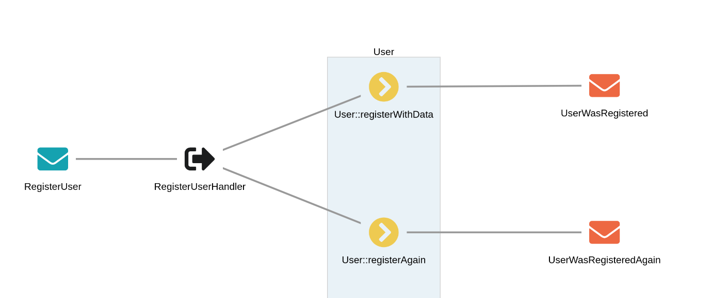
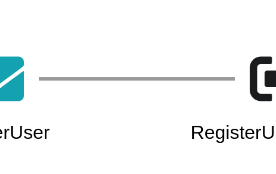
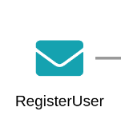
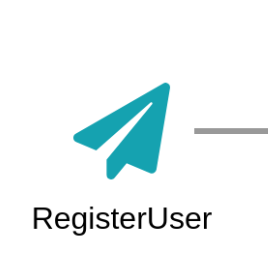

# Message Flow

The message flow is an information bag. It is passed to `visitors` and `finalizers` so that they can add
information to it.

## Nodes and Edges



The `Prooph\MessageFlowAnalyzer\MessageFlow` is organized as a graph of `Prooph\MessageFlowAnalyzer\MessageFlow\Node` objects
and those nodes reference each other through `Prooph\MessageFlowAnalyzer\MessageFlow\Èdge` objects.

### Edge



An edge simply takes a `sourceNodeId` and `targetNodeId` as arguments and is added to the message flow like this:

```php
$abEdge = new Edge($nodeA->id(), $nodeB->id());

$messageFlow = $messageFlow->setEdge($abEdge);
```

*Note: The message flow is implemented as an immutable object. This means that all methods that change state of the flow return
a new version of the object. The old reference is not modified. As the analyzer works a lot with injected logic (custom visitors and finalizers)
an immutable object saves us from weired bugs caused by shared state. Even if it reduces performance of the analyzing process it is the better option.
The message flow analyzer is not meant to be used in production and does not need to run continuously. You want to run it only
after a new feature was added to a project or a refactoring was made.*

### Node



A node describes an element of the message flow. You can set various attributes to distinguish between different node types
and visualize them differently. Here is a list of all node attributes with a short description:

```php
<?php

namespace Prooph\MessageFlowAnalyzer\MessageFlow;

use Prooph\MessageFlowAnalyzer\Helper\Util;

class Node
{
    const TYPE_COMMAND = 'command';
    const TYPE_EVENT = 'event';
    const TYPE_QUERY = 'query';
    const TYPE_HANDLER = 'handler';
    const TYPE_AGGREGATE = 'aggregate';
    const TYPE_PROCESS_MANAGER = 'pm';
    const TYPE_SAGA = 'saga';
    const TYPE_PROJECTOR = 'projector';
    const TYPE_FINDER = 'finder';
    const TYPE_LISTENER = 'listener';
    const TYPE_QUEUE = 'queue';
    const TYPE_READ_MODEL = 'readmodel';
    const TYPE_SERVICE = 'service';

    const MESSAGE_TYPES = [
        self::TYPE_COMMAND,
        self::TYPE_EVENT,
        self::TYPE_QUERY,
    ];

    /**
     * Unique identifier of the node
     *
     * @var string
     */
    private $id;

    /**
     * Used as class name in the UI
     *
     * @var string
     */
    private $type;

    /**
     * Name of the node in the UI
     *
     * @var string
     */
    private $name;

    /**
     * File containing the class/function
     *
     * @var string
     */
    private $filename;

    /**
     * Description of the node
     *
     * Becomes a tooltip in the UI
     *
     * @var string|null
     */
    private $description = null;

    /**
     * Class referenced by the node
     *
     * @var string|null
     */
    private $class = null;

    /**
     * Method of the class that is connected with another node
     *
     * Example:
     * - Command Handler method (target node) handling a command (source node)
     * - Aggregate method (target node) called by a command handler method (source node)
     * - Process manager method (target node) listening on event (source node)
     * - ...
     *
     * @var string/null
     */
    private $method = null;

    /**
     * Global function name (incl. namespace) if node references a function instead of a class
     *
     * @var string/null
     */
    private $funcName = null;

    /**
     * Optional parent node id
     *
     * Nodes with the same parent are grouped in the UI
     *
     * The parent should be a node itself and can be used in an edge
     *
     * Example:
     * Aggregate methods are nodes and their parent is the Aggregate class
     *
     * @var string|null
     */
    private $parent = null;

    /**
     * Optional parent color
     *
     * If this node has a parent with a custom color (default is: #E9F2F7)
     * you have to set the parent color for the child node, too.
     * Parent color is used as icon background color (default is #FFFFFF).
     *
     * @var string|null
     */
    private $parentColor = null;

    /**
     * Additional tags added as class names in the UI
     *
     * @var string[]
     */
    private $tags = [];

    /**
     * FontAwesome or link icon for the node
     *
     * If not set a circle icon is used as default
     *
     * @var NodeIcon/null
     */
    private $icon = null;

    /**
     * Specify the color for the node, if not set a default is used depending on node type
     *
     * @var string|null
     */
    private $color = null;

    /**
     * Optional JSON Schema if node references a message or read model.
     *
     * @var array|null
     */
    private $schema = null;

    /* ... */
}
```
The node class has a set of so called named constructors. You can create nodes of different types using those static methods.
Here is a list of available methods:

```php
<?php

namespace Prooph\MessageFlowAnalyzer\MessageFlow;

use Prooph\MessageFlowAnalyzer\Helper\Util;

class Node
{
    /* ... */
    /**
         * Named constructor for message node
         *
         * @param Message $message
         * @return Node
         */
        public static function asMessage(Message $message): self { /* ... */}
    
        /**
         * Named constructor for command handler nodes
         *
         * Command handler: Function invoked with command that calls an event recorder (aggregate method in most cases)
         *
         * @param MessageHandler $handler
         * @return Node
         */
        public static function asCommandHandler(MessageHandler $handler): self { /* ... */}
    
        /**
         * Named constructor for aggregate nodes
         *
         * Aggregate nodes are used as parents. They are identified by FQCN and their childes are event recorders
         * aka aggregate methods or functions (in case of prooph/micro)
         *
         * @param MessageHandlingMethodAbstract $aggregateMethod
         * @return Node
         */
        public static function asAggregate(MessageHandlingMethodAbstract $aggregateMethod): self { /* ... */}
    
        /**
         * Named constructor for aggregate method nodes
         *
         * Aggregate methods are event recorders that link to a parent aggregate node, so they are grouped together
         * by aggregate.
         *
         * @param EventRecorder $eventRecorder
         * @return Node
         */
        public static function asEventRecordingAggregateMethod(EventRecorder $eventRecorder): self { /* ... */}
    
        /**
         * Named constructor for aggregate methods that act as a factory for another aggregate but do not record events itself.
         *
         * Example:
         * User::postTodo(): Todo
         *
         * @param MessageHandlingMethodAbstract $eventRecorderInvoker
         * @return Node
         */
        public static function asAggregateFactoryMethod(MessageHandlingMethodAbstract $eventRecorderInvoker): self { /* ... */}
    
        public static function asEventListener(MessageHandler $messageHandler): self { /* ... */}
    
        /**
         * Named constructor for process manager nodes
         *
         * A process manager receives an event and produces a new command
         *
         * @param MessageProducer $messageProducer
         * @return Node
         */
        public static function asProcessManager(MessageProducer $messageProducer): self { /* ... */}
    
        /**
         * Named constructor for message producing service nodes
         *
         * A message producing service can be an MVC controller, a PSR-15 request handler, cli command, application service ...
         *
         * @param MessageProducer $messageProducer
         * @param Message $message
         * @return Node
         */
        public static function asMessageProducingService(MessageProducer $messageProducer, Message $message): self { /* ... */}
}
```

You can extend `Prooph\MessageFlowAnalyzer\MessageFlow\Node` and add project specific named constructors that you use in custom
`visitors` or `finalizers`. See `configuration` page for details.

Also most of the node attributes can be modified using corresponding `with<attribute>` or `without<attribute>` methods.
Message flow node objects are immutable, too. Hence, those methods return new node instances instead of modifying the
original one.

The built-in `class visitors` use a `Prooph\MessageFlowAnalyzer\MessageFlow\NodeFactory` to create nodes. 
The factory is a proxy to the named constructors with an option to call a custom `Node` implementation. 
This allows you to easily override default attributes. Again see `configuration` page for details.

Here is an example of a `class visitor` that inspects a reflected php class and if it is a `prooph message` the visitor:

- creates a `MessageFlow\Message` object
- passes it to the appropriate node factory method which calls the named constructor of the node class
- changes the default icon to another font awesome icon (see configuration page) 
- and finally adds the node to the message flow

```php
<?php

declare(strict_types=1);

namespace Prooph\MessageFlowAnalyzer\Visitor;

use Prooph\Common\Messaging\Message as ProophMsg;
use Prooph\MessageFlowAnalyzer\MessageFlow;
use Roave\BetterReflection\Reflection\ReflectionClass;

class MessageCollector implements ClassVisitor
{
    public function onClassReflection(ReflectionClass $reflectionClass, MessageFlow $messageFlow): MessageFlow
    {
        if ($reflectionClass->implementsInterface(ProophMsg::class)) {

            $msg = MessageFlow\Message::fromReflectionClass($reflectionClass);
            
            $msgNode = MessageFlow\NodeFactory::createMessageNode($msg);
            $msgNode = $msgNode->withIcon(MessageFlow\NodeIcon::faSolid('fa-paper-plane'));
            
            //Use addNode if you don't want to override the node in case it is already set
            //if (! $messageFlow->knowsNode($msgNode)) {
            //        $messageFlow = $messageFlow->addNode($msgNode);
            //    }
            $messageFlow = $messageFlow->setNode($msgNode);
        }

        return $messageFlow;
    }
}
```

The visualization of that node will look something like that:




